# 🧪 Projeto QA — Automação de Testes
> Trabalho prático da disciplina de Qualidade de Software — ICEV  
> Desenvolvido por: Mateus Farias

---

## 📌 Índice

1. [Sobre o Projeto](#sobre-o-projeto)
2. [Tecnologias Utilizadas](#tecnologias-utilizadas)
3. [Estrutura do Projeto](#estrutura-do-projeto)
4. [Automação de API — Swagger Petstore](#automação-de-api--swagger-petstore)
5. [Automação Web — SauceDemo](#automação-web--saucedemo)
6. [Design Pattern — Page Object Model](#design-pattern--page-object-model)
7. [CI/CD — GitHub Actions](#cicd--github-actions)
8. [Como Executar Localmente](#como-executar-localmente)
9. [Resultados](#resultados)

---

## Sobre o Projeto

Este projeto implementa dois tipos de automação de testes:

- **Testes de API** cobrindo os principais endpoints do Swagger Petstore (User, Pet e Store), executados via Newman dentro de uma pipeline de CI.
- **Testes Web E2E** no site SauceDemo, simulando o fluxo completo de um usuário: login, adição de produto ao carrinho e finalização de compra, usando Selenium com o padrão Page Object Model.

Ambos os projetos estão integrados ao **GitHub Actions**, que executa os testes automaticamente a cada `git push`.

---

## Tecnologias Utilizadas

| Ferramenta | Finalidade |
|---|---|
| Python 3.11 | Linguagem dos testes web |
| Selenium | Automação do navegador |
| Pytest | Framework de testes |
| python-dotenv | Gerenciamento seguro de credenciais |
| Postman | Criação dos testes de API |
| Newman | Executor do Postman no terminal/CI |
| GitHub Actions | Pipeline de integração contínua |

---

## Estrutura do Projeto

```
projeto-qa-automacao-p2/
├── api-tests/
│   └── Petstore-QA.postman_collection.json
├── web-tests/
│   ├── pages/
│   │   ├── base_page.py
│   │   ├── login_page.py
│   │   ├── inventory_page.py
│   │   ├── cart_page.py
│   │   └── checkout_page.py
│   ├── tests/
│   │   ├── conftest.py
│   │   └── test_fluxo_compra.py
│   └── requirements.txt
└── .github/
    └── workflows/
        ├── api-tests.yml
        └── web-tests.yml
```

---

## Automação de API — Swagger Petstore

**Base URL:** `https://petstore.swagger.io/v2`  
**Ferramenta:** Postman + Newman  
**Executor na CI:** Newman (linha de comando)

### Cenários cobertos

| # | Request | Método | Endpoint | O que valida |
|---|---|---|---|---|
| 1 | Criar Usuário | POST | `/user` | Status 200 e mensagem de sucesso |
| 2 | Buscar Usuário | GET | `/user/estudante_qa` | Status 200 e username correto |
| 3 | Listar Pets Disponíveis | GET | `/pet/findByStatus?status=available` | Status 200 e resposta é uma lista |
| 4 | Criar Pet | POST | `/pet` | Status 200 e nome do pet correto |
| 5 | Buscar Inventário | GET | `/store/inventory` | Status 200 e retorna objeto |
| 6 | Fazer Pedido | POST | `/store/order` | Status 200 e status "placed" |

### Resultado da execução no Newman (CI)


Todos os 6 requests executados com **12 assertions** e **0 falhas**.

---

### Scripts de Teste — Exemplos no Postman

**Criar Usuário — PASSED**

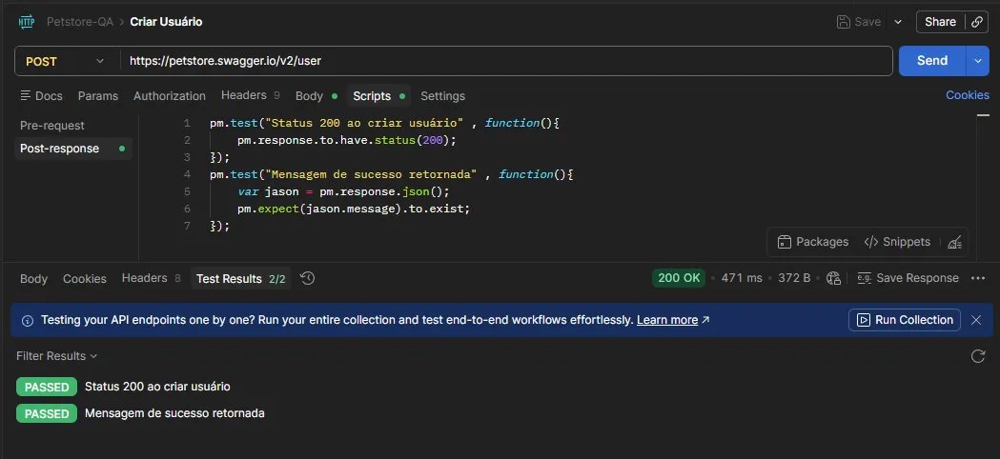

> Valida que o status da resposta é 200 e que a API retornou uma mensagem de confirmação.

---

**Buscar Usuário — PASSED**

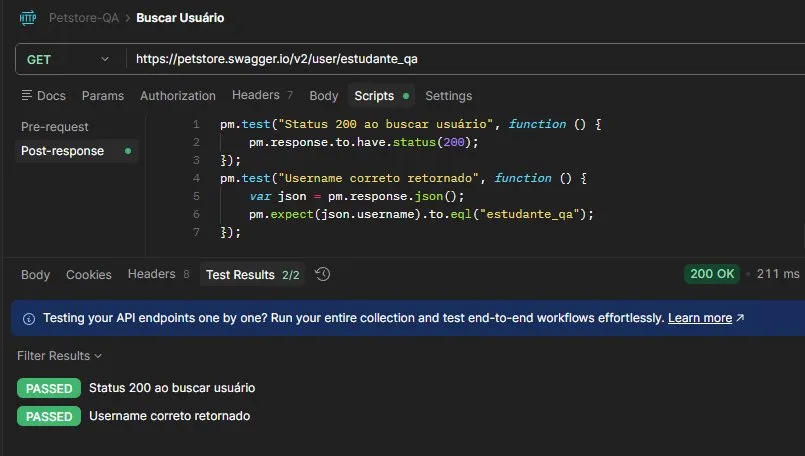

> Valida que o usuário criado anteriormente pode ser buscado e que o `username` retornado é exatamente `estudante_qa`.

---

**Listar Pets Disponíveis — PASSED**

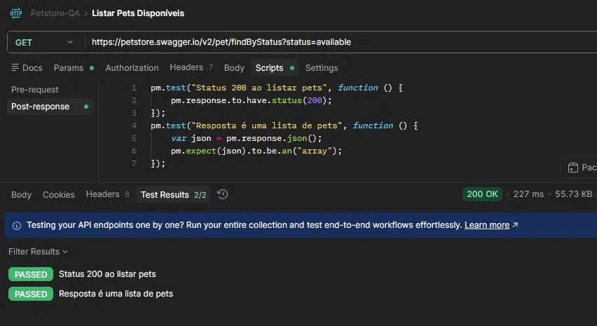

> Valida que a resposta é um array (lista), confirmando que o endpoint retorna o formato correto de dados.

---

**Criar Pet — PASSED**

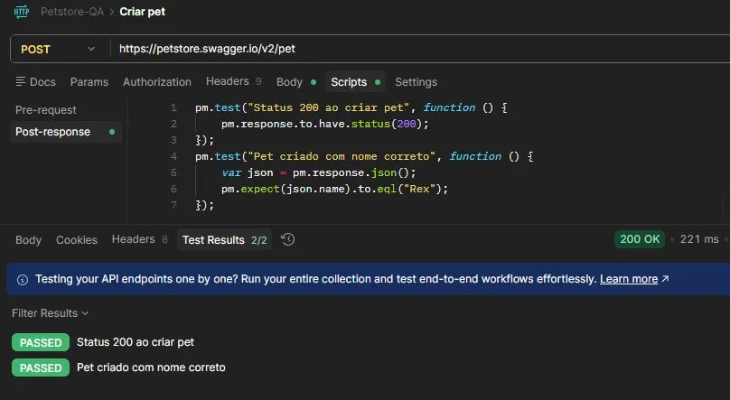

> Valida que o pet foi criado com o nome correto (`Rex`) e que o status da resposta é 200.

---

**Buscar Inventário — PASSED**

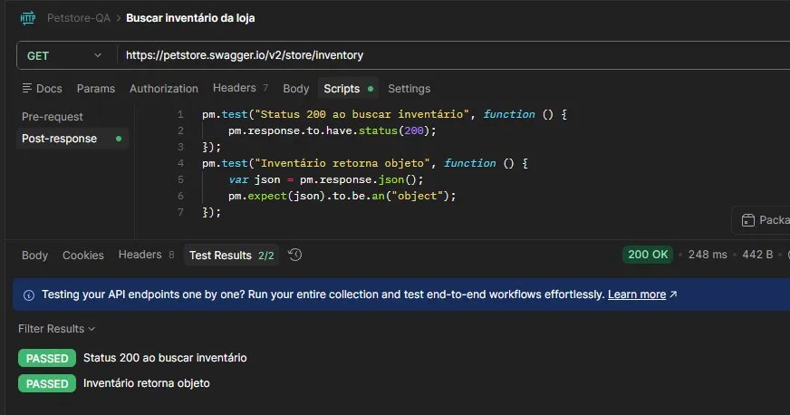

> Valida que o inventário da loja é retornado como um objeto JSON com status 200.

---

**Fazer Pedido — PASSED**

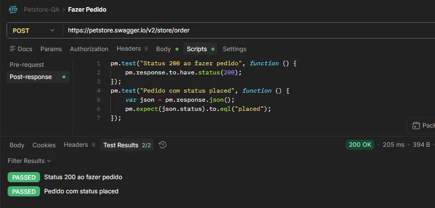

> Valida que o pedido foi criado com status `placed`, confirmando o fluxo completo de compra na API.

---

**Resultado completo do Newman**

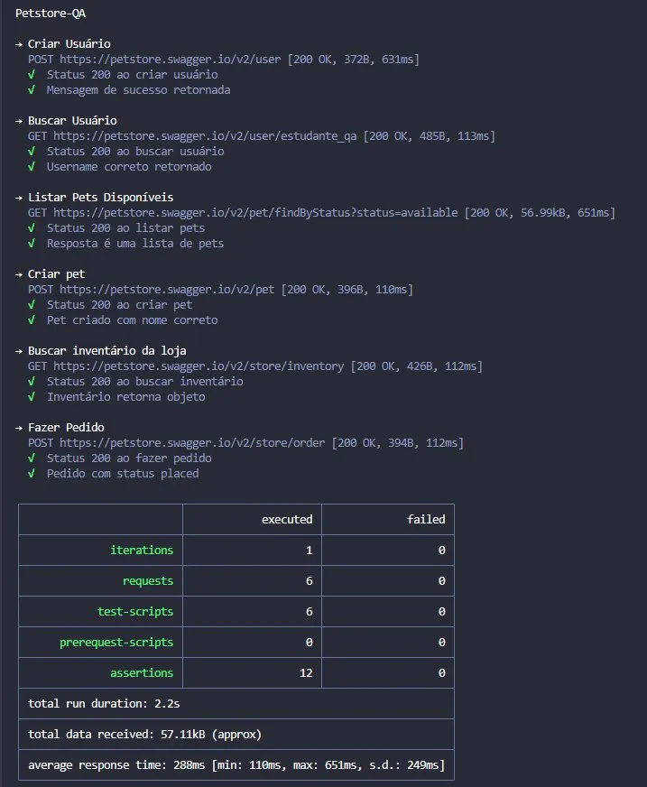

> Tabela final do Newman: 6 requests executados, 12 assertions, 0 falhas.

---

## Automação Web — SauceDemo

**URL:** `https://www.saucedemo.com/`  
**Ferramenta:** Selenium + Pytest  
**Linguagem:** Python 3.11  
**Padrão:** Page Object Model

> O SauceDemo é um site desenvolvido especificamente para prática de automação de testes. Ele simula uma loja virtual com login, catálogo de produtos e carrinho de compras.

### Cenários cobertos

| # | Teste | O que faz |
|---|---|---|
| 1 | `test_login_com_sucesso` | Faz login com credenciais válidas e verifica se chegou na página de produtos |
| 2 | `test_login_invalido_exibe_erro` | Tenta login com dados errados e verifica se a mensagem de erro aparece |
| 3 | `test_fluxo_completo_de_compra` | Login → adiciona produto → vai ao carrinho → preenche dados → finaliza compra → valida mensagem de sucesso |

---

## Design Pattern — Page Object Model

O projeto utiliza o padrão **Page Object Model (POM)**, que consiste em criar uma classe Python para cada tela do sistema. Isso separa a **localização dos elementos** da **lógica dos testes**, tornando o código mais limpo, organizado e fácil de manter.

### `base_page.py` — Classe Mãe

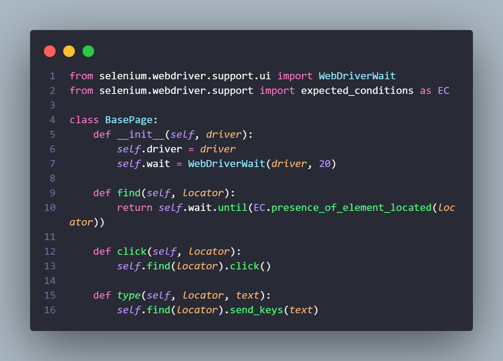

> É a classe base que todas as outras herdam. Centraliza os métodos `find()`, `click()` e `type()`, além de configurar o `WebDriverWait` com timeout de 20 segundos. Isso evita repetição de código em todas as páginas.

---

### `login_page.py` — Tela de Login

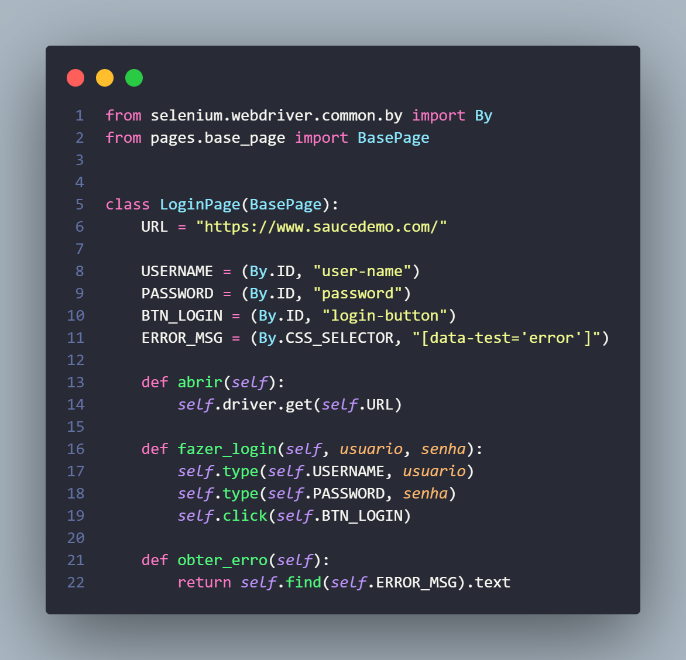

> Representa a tela de login do SauceDemo. Define os localizadores dos campos (`By.ID`) e os métodos `abrir()`, `fazer_login()` e `obter_erro()`. O teste nunca acessa o HTML diretamente — tudo passa por esta classe.

---

### `inventory_page.py` — Catálogo de Produtos

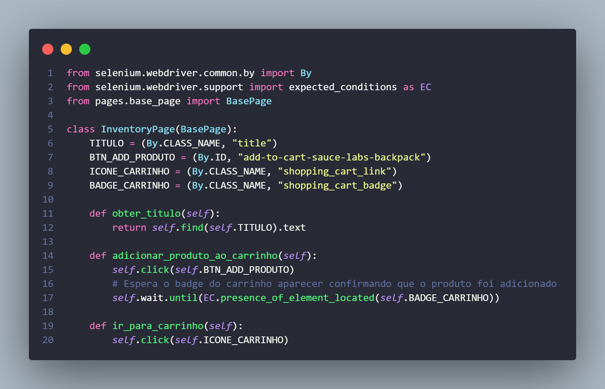

> Representa a página de produtos. O método `adicionar_produto_ao_carrinho()` clica no botão e aguarda o badge do carrinho aparecer antes de continuar, garantindo que o produto foi realmente adicionado antes de ir para o próximo passo.

---

### `cart_page.py` — Carrinho

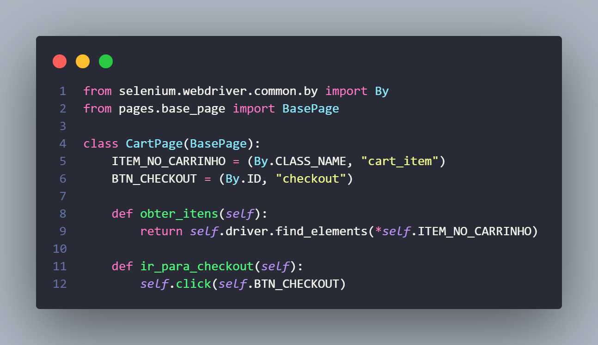

> Representa o carrinho de compras. O método `obter_itens()` retorna todos os itens presentes, permitindo que o teste verifique se a quantidade está correta antes de ir para o checkout.

---

### `checkout_page.py` — Finalização da Compra

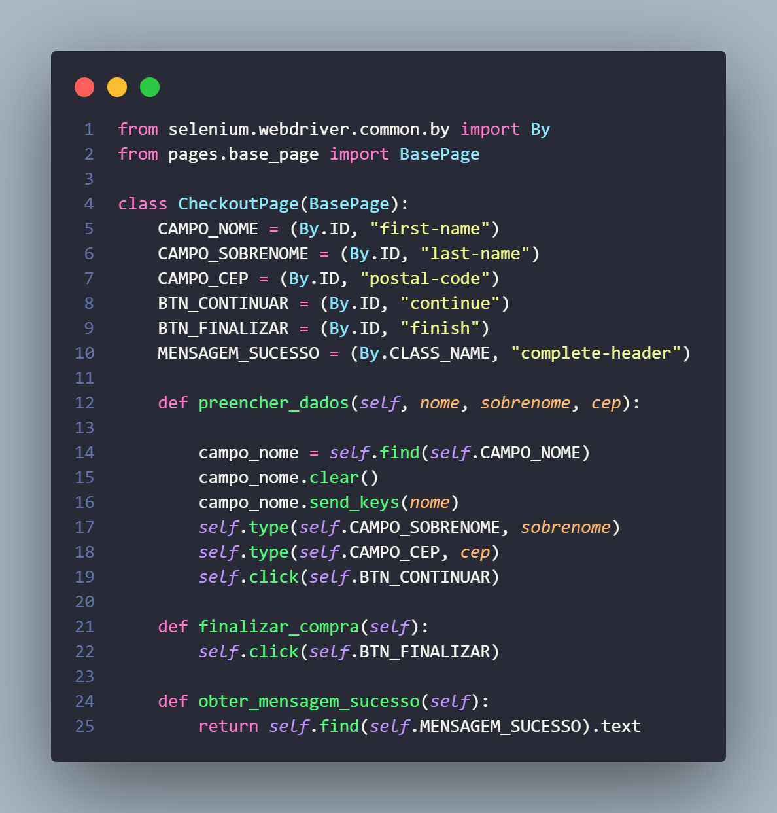

> Representa as telas de checkout. O método `preencher_dados()` preenche nome, sobrenome e CEP. O método `obter_mensagem_sucesso()` captura o texto final de confirmação que é validado pelo `assert`.

---

### `conftest.py` — Configuração dos Testes

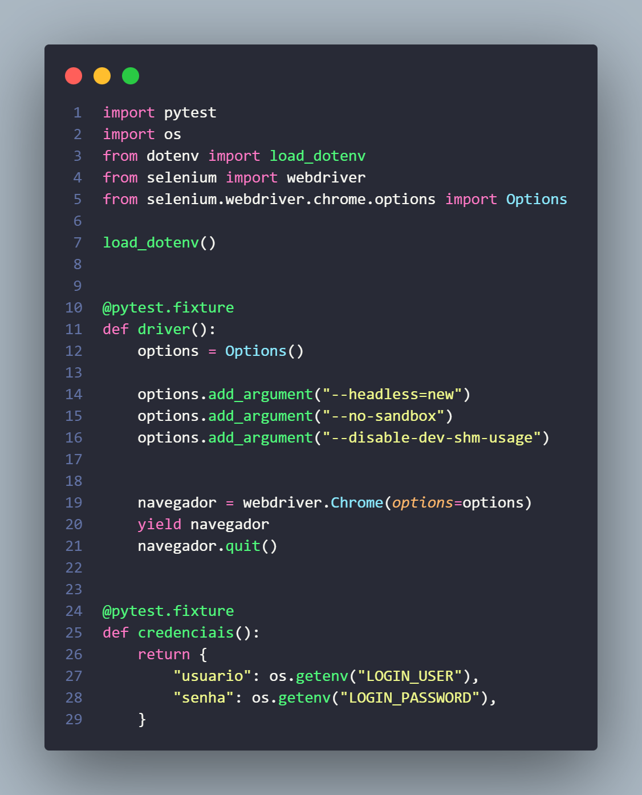

> Arquivo de configuração do Pytest. Define as **fixtures** reutilizáveis por todos os testes:
> - `driver`: inicializa o Chrome com modo `--headless` (sem abrir janela, necessário para CI), entrega o navegador para o teste e fecha ao final.
> - `credenciais`: lê o usuário e senha do arquivo `.env` de forma segura.

---

### `test_fluxo_compra.py` — Arquivo de Testes

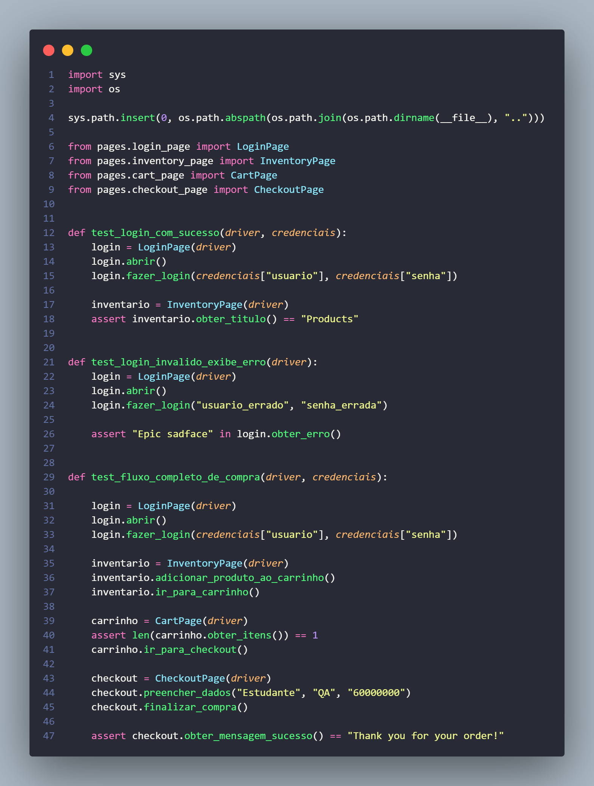

> Contém os 3 cenários de teste. Cada função usa as Page Objects e as fixtures do `conftest.py`. O `assert` no final de cada teste é a **validação** — se o resultado for diferente do esperado, o teste falha e a pipeline fica vermelha.

---

## CI/CD — GitHub Actions

O projeto possui duas pipelines independentes que rodam automaticamente a cada `git push` na branch `main`.

### Pipeline de API — Testes de API Petstore

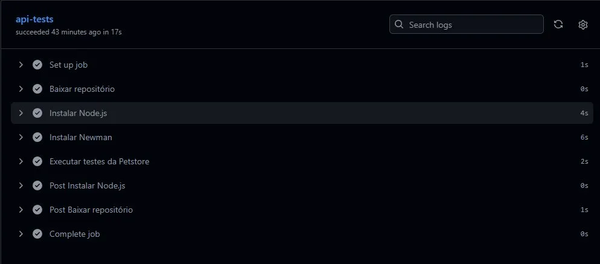

**O que ela faz, passo a passo:**
1. Baixa o repositório
2. Instala o Node.js
3. Instala o Newman (executor do Postman)
4. Executa a collection com todos os testes

---

### Pipeline Web — Testes Selenium SauceDemo

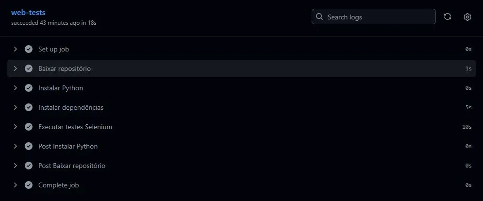

**O que ela faz, passo a passo:**
1. Baixa o repositório
2. Instala o Python 3.11
3. Instala as dependências do `requirements.txt`
4. Executa os testes com Pytest (usando os Secrets do GitHub como credenciais)

> As credenciais (`LOGIN_USER` e `LOGIN_PASSWORD`) são armazenadas nos **Secrets do GitHub** e nunca ficam expostas no código.

---

## Como Executar Localmente

### Pré-requisitos

- Python 3.11+
- Node.js 20+
- Google Chrome instalado

### Testes de API

```bash
npm install -g newman
newman run api-tests/Petstore-QA.postman_collection.json --reporters cli
```

### Testes Web

```bash
# 1. Instalar dependências
cd web-tests
pip install -r requirements.txt

# 2. Criar o arquivo .env
# LOGIN_USER=standard_user
# LOGIN_PASSWORD=secret_sauce

# 3. Executar os testes
python -m pytest tests/ -v
```

---

## Resultados

### ✅ Pipeline de API — 0 falhas

- 6 requests executados
- 12 assertions validadas
- 0 falhas

### ✅ Pipeline Web — 3/3 testes passando

- `test_login_com_sucesso` — PASSED
- `test_login_invalido_exibe_erro` — PASSED
- `test_fluxo_completo_de_compra` — PASSED

---
